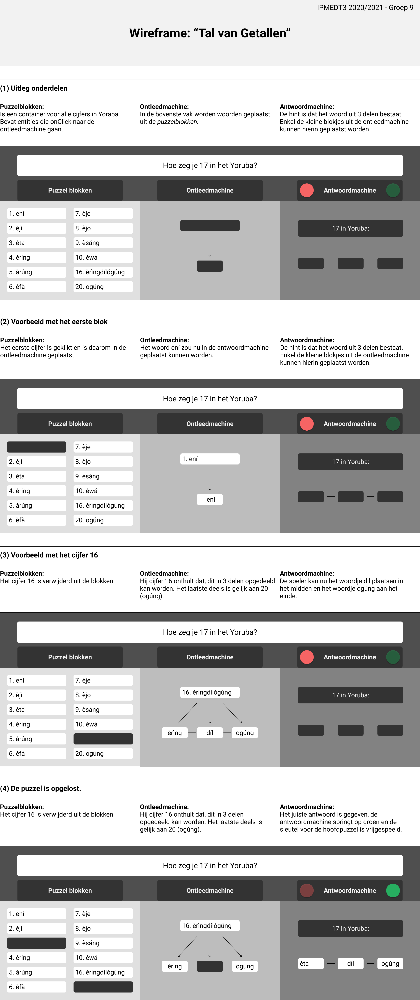

<h1>Puzzel 3: Vijf Talen, Vijf Schriften</h1>

<h2>Inleiding</h2>
Dit is een puzzel gebaseerd op de 'Vijf Talen, Vijf Schriften' van de Escape Room van 2019.
Het doel van de puzzel is om 17 in het Yoruba te kunnen zeggen.

Het eerste hintblad:
```
1. Papers van vorige week bespreken
2. Introductie college ‘telwoorden’
3. Leg diversiteit telsystemen op de wereld uit
4. Focus op Yoruba. Voorbeeld: 17 = [koffievlek]
5. Afsluiting: opdracht uitleggen’
```

Het tweede hintblad bevat getallen in het Yoruba:
```
1. ení
2. èjì
3. èta
4. èring
5. àrúng
6. èfà
7. èje
8. èjo
9. èsáng
10. èwá
16. èrìngdílógúng
20. ogúng
```

Aan de hand van het getal 16 kom je erachter dat je moet aftrekken vanaf 20: èringdílógúng’16’ kun je opdelen in èring (4), díl (zal dus iets zijn als ‘minder dan’) en ógúng (20). 17 is dus ‘3 minder dan 20’, en wordt dus ètadílógúng.
Als de bezoekers dit hadden opgelost, was de puzzel klaar en kreeg je de letter T. In ons geval krijgt de speler één van de keys die nodig is om de hoofduitgang te ontgrendelen.

<h2>Wireframe van de Puzzel</h2>

